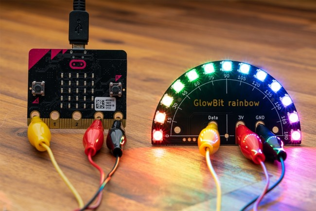

# Core Electronics GlowBit­™ rainbow
This is the hardware repo for the Core Electronics *GlowBit rainbow*

The [GlowBit™ rainbow](https://core-electronics.com.au/glowbit-rainbow.html) is a beautiful LED display and is a Core Electronics original (made right here in Newcastle, Australia). Onboard, there are 13 individually addressable LEDs – all driven by a single IO pin. Alligator + Banana-plug connections make the rainbow a perfect companion for micro:bit or Circuit Playground since there's no soldering required.

Our [getting started guide](https://core-electronics.com.au/tutorials/glowbit-rainbow-quickstart-guide-for-micro-bit.html) covers off on the setup and an example first project. From there, remix to your heart's content. This is the perfect companion for the micro:bit onboard accelerometer and compass, along with other creative ways to display useful information such as angles, gauges, or colourful patterns on a rainbow.

GlowBit devices use the latest WS2812B v5 technology LEDs which are compatible with existing WS2812 / NeoPixel libraries available for popular development boards.

**Features**
- Works with micro:bit V1 and V2, Circuit Playground, and other maker favourites
- 13x WS2812B-v5 LEDs, compatible with NeoPixel
- Individually controlled LEDs from a single pin
- Connect with alligator clips, banana plugs or the 4pin breakout header
- Protractor inspired artwork - each LED is labelled in 15-degree increments, across a 180-degree curve
- Chainable - the breakout header has a data output so you can daisy-chain multiple rainbows together
- [Quickstart guide and instructions](https://core-electronics.com.au/tutorials/glowbit-rainbow-quickstart-guide-for-micro-bit.html)
- Manufactured and supported in Australia by Core Electronics

# License
This project is open source - please review the LICENSE.md file for further licensing information.

If you have any technical questions, or concerns about licensing, please contact technical support on the [Core Electronics forums](https://forum.core-electronics.com.au/).

*\"GlowBit\" is a trademark of Core Electronics Pty Ltd.*
